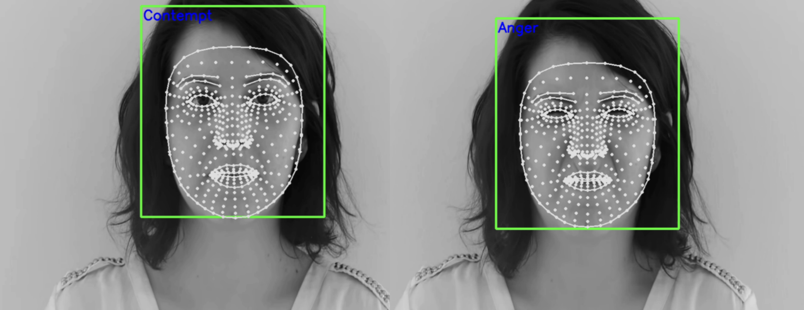

# ELEC0054_Research_Project_23_24-SN23043574
This is the Research Project for 23/24 ELEC0054 Msc IMLS SN23043574. Notice that the project is also provided with Google drive link provided in my paper. The usage is illustrated in following sections.
>**Time:** 09/03/2024-02/09/2024 \
**Author:** 23043574 \
**Programme:** Msc Integrated Machine Learning Systems (TMSIMLSSYS01) \
**Module**: ELEC0054 Research Project \
**Project name:** Automatic Emotion Detection \
**Scope:** Deep Learning, Machine Learning, Research and simulation \
**Github:** https://github.com/uceewl4/ELEC0054_Research_Project_23_24-SN23043574.git . The private respository will become public once the deadline is passed. You can download the project through Github or Google Drive link provided in the report: . 
To emphasize, most part of the project is run on UCL GPU server of turin.ee.ucl.ac.uk (you can also find my folder at /scratch/uceewl4/ELEC0054_Research_Project_23_24-SN23043574/), so it will be much slower if you run it on CPU. Some quicker models are recommended in the usage for you to run on CPU with small epochs. Please also see the video demonstration in Google Drive as well. Please follow the guidelines in Requirement and Usage to run the project. Thanks a lot.

## Description
### 1. Project Structure 
- **main.py:** main codes for running the project
- **utils.py:** experimental setups, utility functions, tools, visualizations and metrics
- **requirement.txt:** package requirements for the project
- **environmental.yml:** conda environment for the project
- **application.py:** application implementation for video and real-time capture
- **tmp.py:** some intermediate draft when writing codes
- **datasets**
  - image: 3 datasets for image emotion detection including CK+, FER-2013, RAF-DB
  - speech: 7 datasets for speech emotion detection including AESDD, CREMA-D, EmoDB, eNTERFACE-05, RAVDESS, SAVEE, TESS
    
- **models**
  - **image:**
    - **CNN.py:**: model implementation for CNN
    - **MLP.py:**: model implementation for MLP
    - **shape_predictor_5_face_landmarks.dat:**: facial predictor for 5 landmarks
    - **shape_predictor_68_face_landmarks.dat:**: facial predictor for 68 landmarks
    - **ViT.py:**: model implementation for vision transformer
    - **Xception.py:**: model implementation for Xception
  - **speech:**
    - **AlexNet.py:**: model implementation for AlexNet
    - **baselines.py:**: model implementation for basic classifiers
    - **CNN.py:**: model implementation for CNN
    - **DBSCAN.py:**: model implementation for DBSCAN
    - **GMM.py:**: model implementation for GMM
    - **KMeans.py:**: model implementation for K-Means clustering
    - **LSTM.py:**: model implementation for LSTM
    - **MLP.py:**: model implementation for MLP
    - **RNN.py:**: model implementation for RNN
    - **wav2vec.py:**: model implementation for Wav2Vec 2.0
  

- **outputs**: all outputs of the project including generated audios, images, metrics and visualization from modelling experiments and trials. 
  - **application:** test video for application
  - **image:** 
    - **confusion_matrix:** generated confusion matrix for image emotion detection
    - **emotion_labels:** emotion label proportion of image datasets
    - **landmarks:** generated landmarks of image datasets
    - **models:** saved models of image emotion detection
    - **nn_curves:** convergence curves of image models
    - **patches:** segmented patches of ViT
    - **process:** images after processing operations
  - **speech:** 
    - **confusion_matrix:** generated confusion matrix for speech emotion detection
    - **corr_matrix:** correlation matrix for speech datasets
    - **corr_signal:** auto-correlation and cross-correlation of signals for speech datasets
    - **corr_signal_filter:** auto-correlation and cross-correlation of signals for speech datasets after low-pass filtering
    - **corr_signal_ma:** auto-correlation and cross-correlation of signals for speech datasets after MA
    - **corr_signal_MAV:** auto-correlation and cross-correlation of signals for speech datasets after MAV
    - **emotion_labels:** emotion label proportion of speech datasets
    - **features:** features visualization for speech datasets
    - **hyperpara_selection:** curves of grid search hyperparameter selection
    - **models:** saved models of speech emotion detection
    - **nn_curves:** convergence curves of speech models
    - **signal_similarity:** similarity scores and graphs for speech datasets
    - **trees:** visualization for DTs

### 2. Experimental Results
> Detailed results for single-corpus and cross-corpus experiments in speech and image emotion detection can be seen in project report.

## Requirements
  Original developing environment:
  - Visual Studio Code 1.91.1 (Universal)
  - **CPU platform:** Python 3.11.8 and Anaconda virtual environment for conda 23.7.4. You can check all requirements in requirements.txt and environment in environment.yml. 
  - **GPU plaform:** UCL server: turin.ee.ucl.ac.uk and geneva.ee.ucl.ac.uk with Python 3.12.2, Anaconda virtual environment for conda 23.7.4 and cuda version 12.4.

## Usage
- Step 1: Create environment with corresponding version mentioned in **Requirements** with Anaconda Navigator.
- Step 2: Install requirement packages for the environment: 
  
<code>pip install -r requirements.txt</code>

  It's also ok for you to combine step 1 and 2 together to run:
    
<code>conda env create -f environment.yml</code>

- Step 3: you can run the project with the following commands.
** Notice: Most of the project is run on GPU server, it may be much slower to run on CPU. So it's suggested that if you want to check the model implementation on CPU, try some fast model to see their performance as recommended.**

      speech emotion detection (--task speech): default CNN, NB, etc. (You can also try other models on GPU through my folder in /scratch/uceewl4/ or can set a small epoch on CPU to see their performance.)
      image emotiond detection (--task image): default CNN, MLP, Xception, etc.

  **Single-corpus experiments:**
  
<code>python main.py --dataset TESS --method NB</code>

  
<code>python main.py --dataset TESS --method CNN --epochs 1</code>

  
<code>python main.py --task image --dataset CK --method CNN --epochs 1</code>

  
  **Cross-corpus experiments:**
  
<code>python main.py --dataset TESS --method CNN --epochs 1 --split 4</code>

  
<code>python main.py --corpus TESS RAVDESS --method CNN --epochs 1 --split 0.8</code>
 
  
<code>python main.py --task image --dataset CK --method CNN --epochs 1 --split 4</code>

  
<code>python main.py --task image --corpus CK RAF --method CNN --epochs 1 --split 0.8</code>

  **For cross-corpus experiment, the arguments for corpus are training (first) and testing (second) datasets of mixture. There are several other arguments which can be specified to select different model scenario. Default scenario is CNN for speech emotion detection with 2 epochs. You can specify the argument as follows:**

    --task: speech or image emotion detection. **If you want to perform image emotion detection, the task must be set as image.

    --method: model selected, default CNN. for speech emotion detection, the model could be "CNN", "NB", "SVM", "DT", "KNN", "AlexNet","MLP", etc. for image emotion detection, the model could be "CNN", "Xception", "MLP", etc. **Notice that your choice of task and method must be compatible.**

    --features: features of speech emotion detection like mfcc, all, mel, chroma, default mfcc.

    --batch_size: batch size of different methods, default 32.

    --epochs: epochs of different methods, default 2.

    --lr: learning rate of different methods, default 0.001.

    --n_mfcc: number of mfcc features, default 40.

    --n_mels: number of mel features, default 128.

    --sr: sampling rate, default 16000.

    --max_length: max length for padding in CNN of speech emotion detection, default 150.

    --reverse: play the audio in a reverse way, default False.

    --noise: play the audio with white noise, white/buzz/bubble/cocktail effect, default None.

    --denoise: play the audio by denoising, default None.

    --landmark: number of landmark for image emotion detection, 5/68/xyz(468), default None.

    --window: an array of integers as starting and ending point of window.

    --bidirectional: whether construct bidirectional for RNN, default False.

    --cv: whether cross validation, default None.

    --cc: experiment setup like single, cross, mix, finetune, default single.

    --scaled: feature processing like standard, minmax, default None.

    --corpus: an array of string indicating mixture of corpus in cross-corpus setting, default None.

    --split: plit of size for cross-corpus setting, including 0.2/0.4/0.5/0.6/0.8, 4/3/2.5/2/1, default None.

    --process: image processing operation, blur/noise/filter/sobel/equal/assi, default None.

 
        